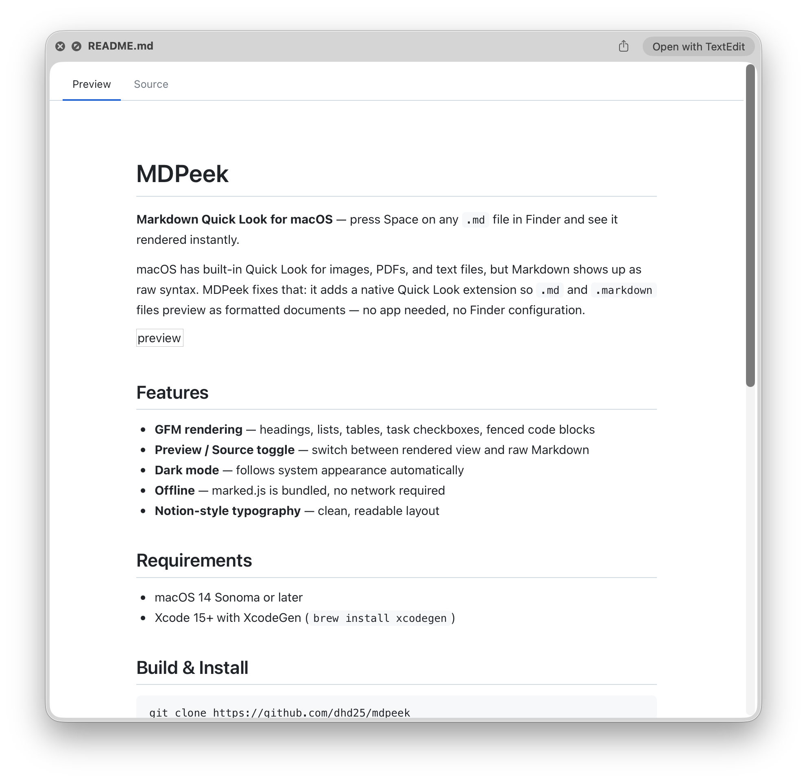
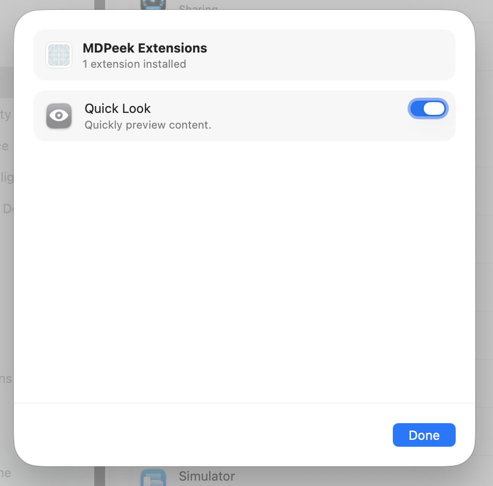

[English](README.md) | [한국어](README.ko.md)

# MDPeek

**Markdown Quick Look for macOS** — press Space on any `.md` file in Finder and see it rendered instantly.

macOS has built-in Quick Look for images, PDFs, and text files, but Markdown shows up as raw syntax. MDPeek fixes that: it adds a native Quick Look extension so `.md` and `.markdown` files preview as formatted documents — no app needed, no Finder configuration.



## Features

- **GFM rendering** — headings, lists, tables, task checkboxes, fenced code blocks
- **Preview / Source toggle** — switch between rendered view and raw Markdown
- **Frontmatter hidden in preview** — YAML frontmatter is stripped from the rendered view; still visible in Source tab
- **Dark mode** — follows system appearance automatically
- **Offline** — marked.js is bundled, no network required
- **Notion-style typography** — clean, readable layout

## Install (No Xcode needed)

1. Download **MDPeek.zip** from [Releases](https://github.com/dhd25/mdpeek/releases) and unzip
2. Move `MDPeek.app` to `/Applications`
3. Open once to register the extension:
   ```bash
   open /Applications/MDPeek.app
   ```
4. Bypass Gatekeeper (required for apps without Apple notarization):
   ```bash
   xattr -dr com.apple.quarantine /Applications/MDPeek.app
   ```
5. Enable the extension:
   - **macOS Ventura (13) and later:** System Settings → **General → Login Items & Extensions** → Extensions → Quick Look → check **MDPeek**
   - **macOS Monterey (12) and earlier:** System Settings → **Privacy & Security → Extensions** → Quick Look → check **MDPeek**



Press Space on any `.md` file in Finder — done.

---

## Build from Source

### Requirements

- macOS 14 Sonoma or later
- Xcode 15+ with XcodeGen (`brew install xcodegen`)

## Build & Install

```bash
git clone https://github.com/dhd25/mdpeek
cd mdpeek
xcodegen generate
open MDPeek.xcodeproj
```

In Xcode:
1. Select the **MDPeek** scheme
2. **Signing & Capabilities** → set Team to your Apple ID (free Personal Team works)
3. Build ⌘B → Run ⌘R

Copy to Applications:

```bash
cp -R ~/Library/Developer/Xcode/DerivedData/MDPeek-*/Build/Products/Debug/MDPeek.app /Applications/
open /Applications/MDPeek.app
```

Enable the extension:

- **macOS Ventura (13) and later:** System Settings → **General → Login Items & Extensions** → Extensions → Quick Look → check **MDPeek**
- **macOS Monterey (12) and earlier:** System Settings → **Privacy & Security → Extensions** → Quick Look → check **MDPeek**

Verify it's registered:

```bash
qlmanage -m plugins | grep -i mdpeek
```

## Privacy

MDPeek runs fully sandboxed and collects no data.

- **File access:** read-only, limited to the file you preview
- **Network:** used only to load remote images embedded in Markdown files (e.g. ``) — no tracking or external calls
- **No analytics, no tracking, no external connections**

## Known Limitations

- **Remote images** are displayed when internet is available, shown as broken image when offline.
- **Local images** (relative paths, e.g. ``) are supported when the image is in the same folder as the Markdown file.

## Customize

All visual styling lives in `MDPeekQL/Resources/style.css`. Edit it, rebuild, and reinstall the app to apply changes.

## License

MIT — see [LICENSE](LICENSE)
